CODESYS es el entorno de programación de PLC (norma IEC 61131-3) utilizado en el curso de Automatización Industrial. Esta guía cubre su instalación en Windows 11.

## Instalación en Windows 11

### Descarga del instalador

1. Abra el navegador y diríjase al sitio oficial de CODESYS (https://www.codesys.com/). Acceda a la sección de descargas y seleccione **CODESYS V3** para Windows.

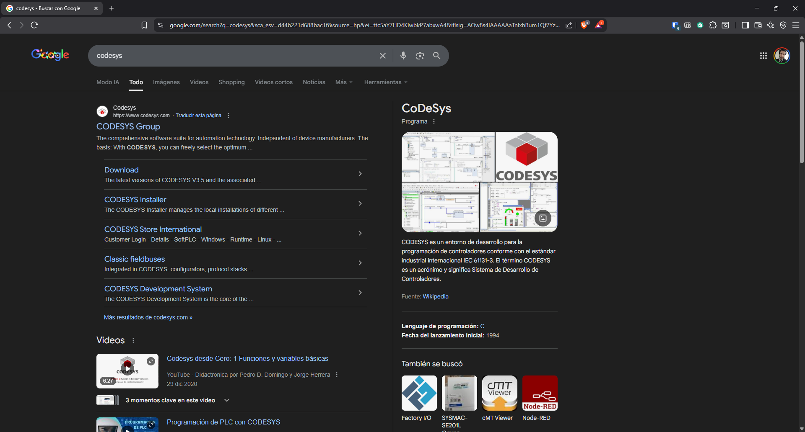

2. Es posible que el sitio solicite registrarse o seleccionar la edición (CODESYS Development System). Descargue el instalador ejecutable.

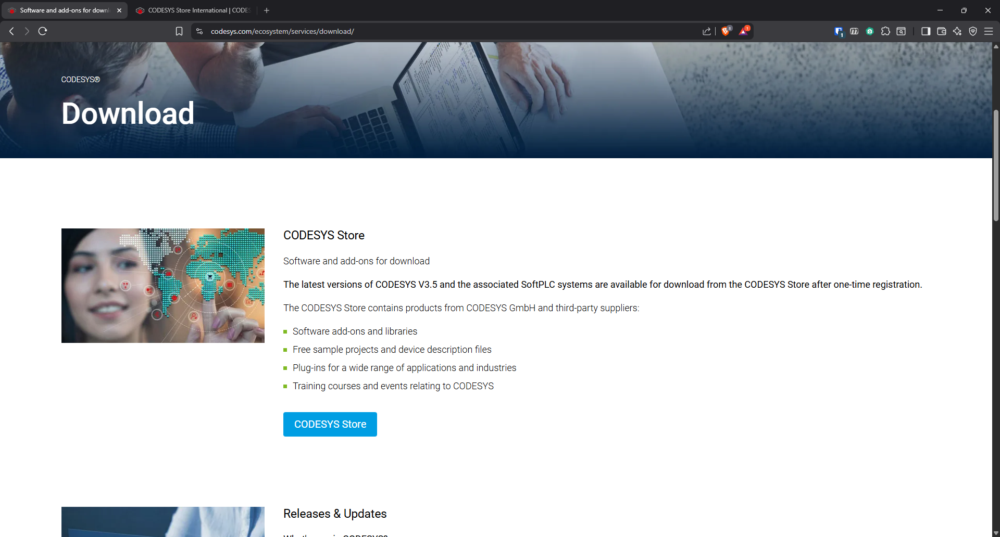

3. Una vez finalizada la descarga, ubique el archivo en la carpeta de descargas.

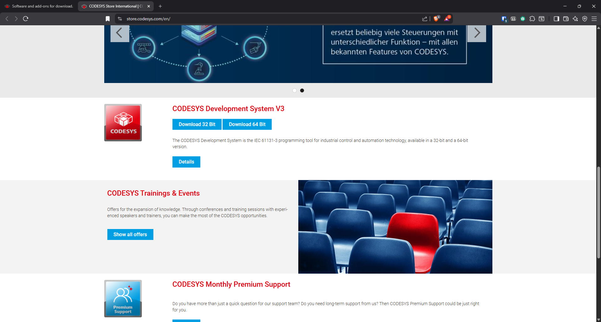

### Ejecución del instalador

4. Ejecute el instalador. Si Windows muestra el aviso de control de cuentas de usuario (UAC), presione **Sí** para permitir la instalación.

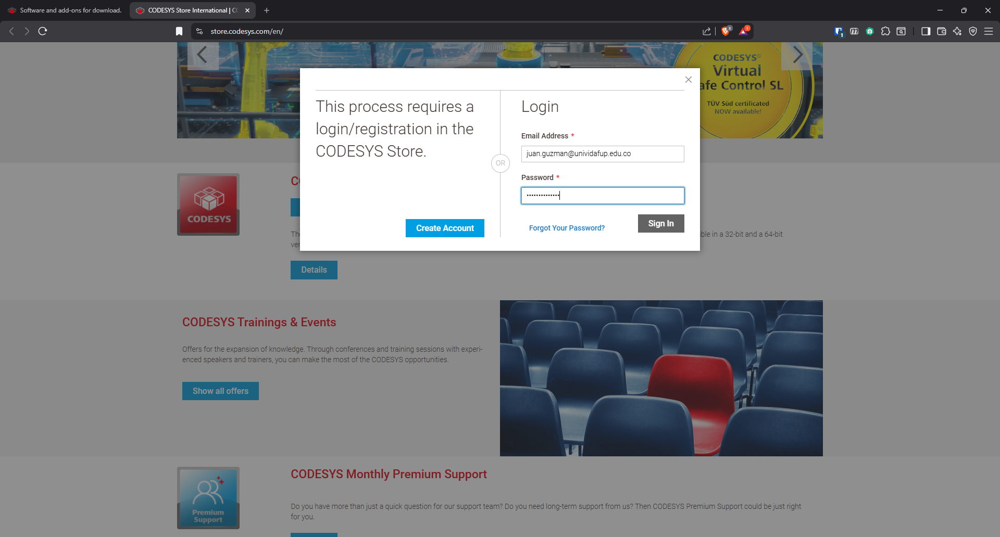

5. El instalador prepara el entorno y muestra la ventana de bienvenida.

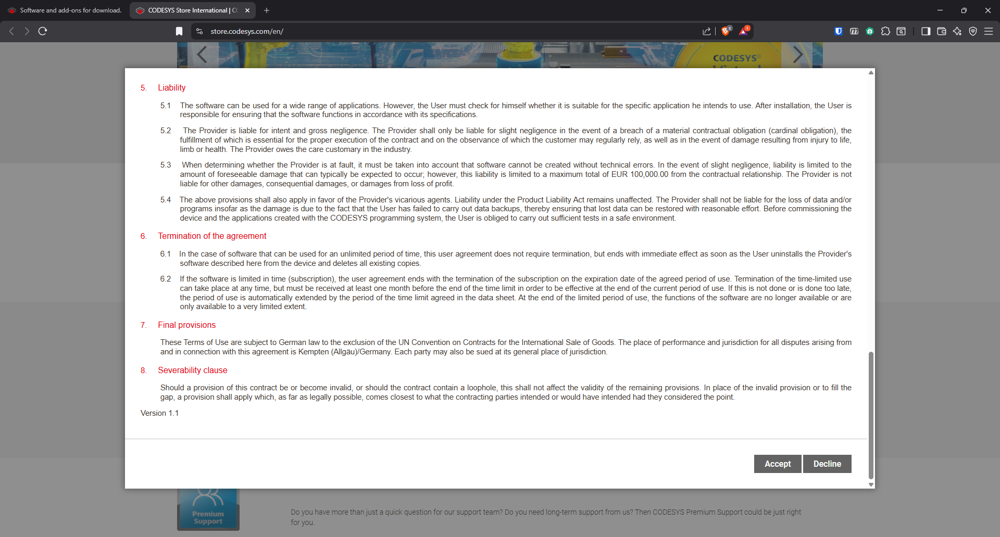

6. Acepte el acuerdo de licencia y presione **Siguiente**.

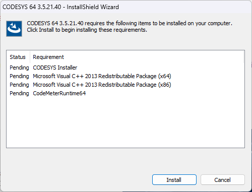

7. Seleccione los componentes que desea instalar. Se recomienda dejar la selección por defecto (incluye el runtime de simulación CODESYS Control Win V3 y los dispositivos de la familia CODESYS).

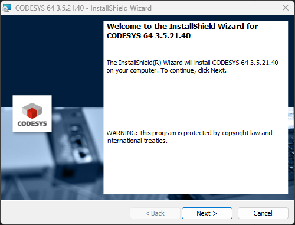

8. En la ventana de selección de dispositivos adicionales, mantenga las opciones sugeridas y presione **Siguiente**.

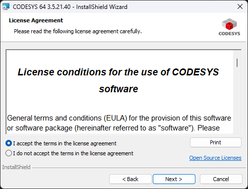

9. Indique la ruta de instalación. Se sugiere dejar la ruta por defecto.

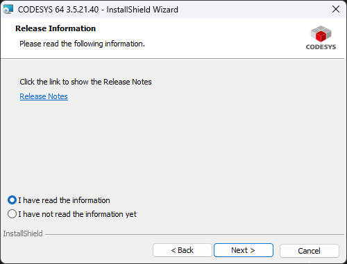

10. Revise el resumen de la instalación y presione **Instalar**.

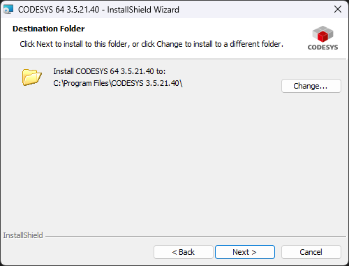

11. Espere a que el instalador copie los archivos. Este proceso puede tomar varios minutos.

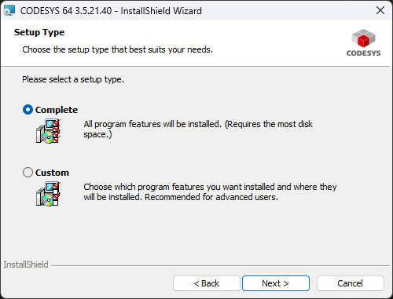

12. Finalice la instalación presionando **Finalizar** (Finish).

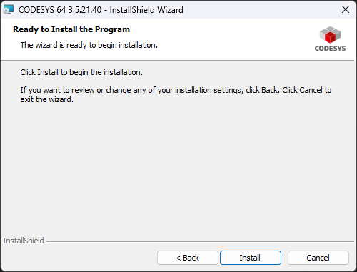

13. Si el instalador lo solicita, reinicie el equipo para completar la configuración del sistema.

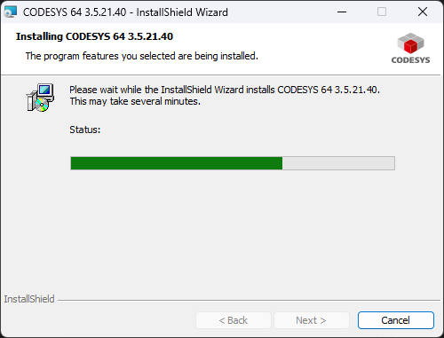

14. En el escritorio o menú de inicio aparecerá el acceso directo de CODESYS V3.5.

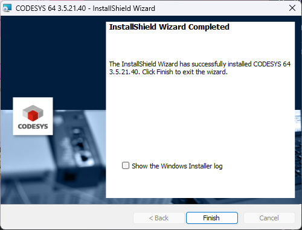

### Primera ejecución

15. Al abrir CODESYS por primera vez, se despliega un cuadro de diálogo de configuración inicial. Marque la opción que considere apropiada y presione **Continuar**.

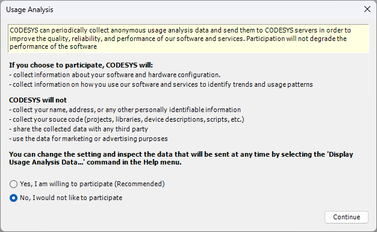

16. Esta es la ventana principal de CODESYS. Desde aquí se crean proyectos nuevos con **New Project**, tal como se describe en la [guía de conexión con Factory IO por OPC UA](codesys_factoryio_opcua.qmd).

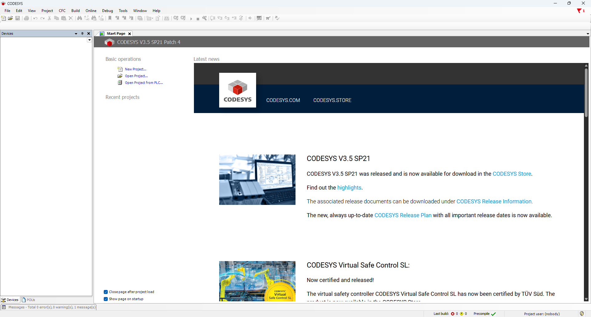

## Verificación

- [ ] CODESYS abre correctamente y muestra la ventana principal.
- [ ] En la lista de dispositivos aparece **CODESYS Control Win V3 x64** (PLC de simulación).

## Siguientes pasos

- [Instalación de Factory IO](factoryio_install.qmd)
- [Configuración de Codesys y Factory IO mediante OPC UA](codesys_factoryio_opcua.qmd)
