Git es el sistema de control de versiones utilizado en los cursos de programación y documentación por código. Esta guía cubre la instalación de Git para Windows y su verificación dentro de Visual Studio Code.

## Instalar Git

### Descarga e instalación

1. Abra el navegador y diríjase a https://git-scm.com/. Presione el botón de **Descargar** para la versión de Windows.

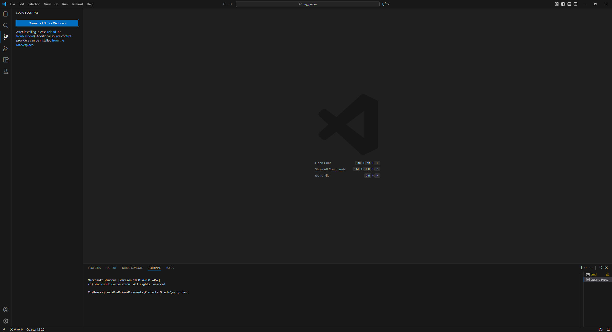

2. Se descargará el instalador ejecutable (por ejemplo, `Git-2.x.x-64-bit.exe`). Ejecútelo.

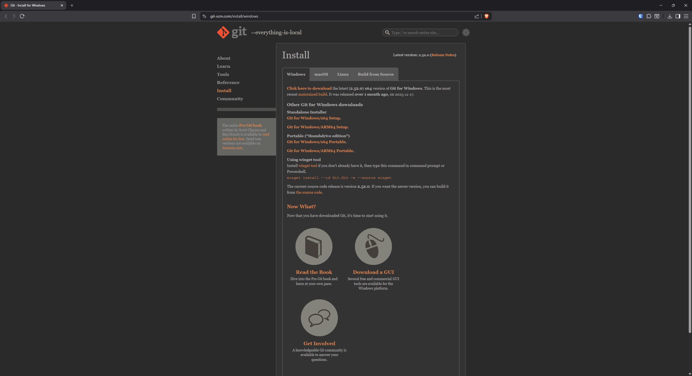

3. El instalador muestra la información de la licencia GNU. Presione **Next**.

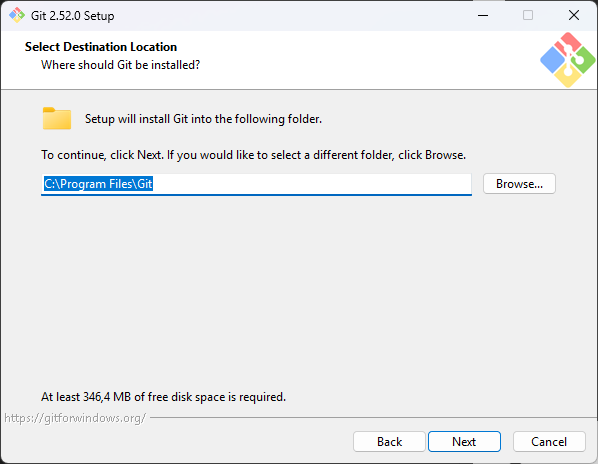

4. Indique la ruta de instalación. Se sugiere dejar la ruta por defecto y presionar **Next**.

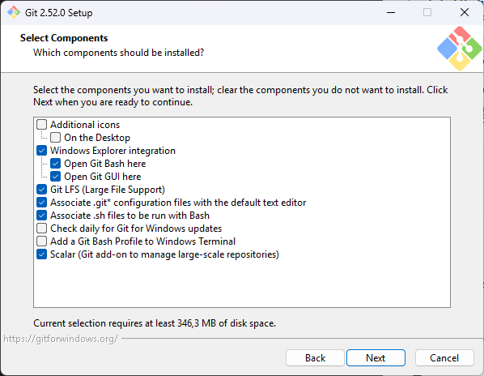

5. En la selección de componentes, mantenga las opciones por defecto (incluye Git Bash y Git GUI) y presione **Next**.

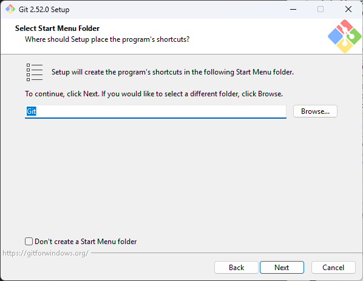

6. Seleccione la carpeta del menú Inicio para los accesos directos y presione **Next**.

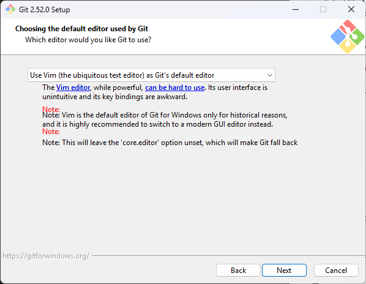

7. Elija el editor por defecto para los mensajes de Git. Se recomienda **Visual Studio Code** (si ya está instalado) o **Notepad++**.

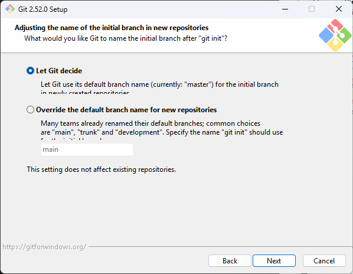

8. En el ajuste del PATH, seleccione **Git from the command line and also from 3rd-party software** (recomendado) y presione **Next**.

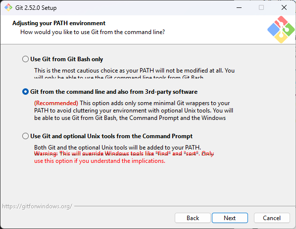

9. Seleccione el cliente HTTPS. Se recomienda **Use the OpenSSL library** y presione **Next**.

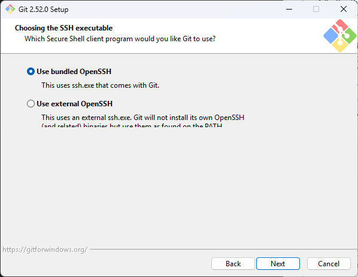

10. En la configuración de fin de línea, seleccione **Checkout Windows-style, commit Unix-style line endings** (opción por defecto) y presione **Next**.

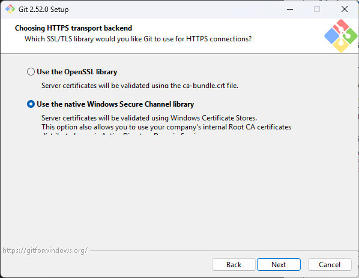

11. Elija el emulador de terminal para Git Bash. Se recomienda **Use MinTTY** y presione **Next**.

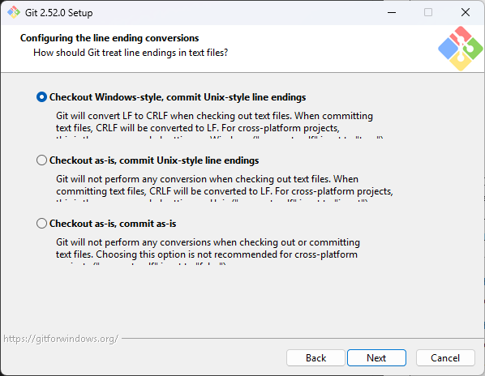

12. Seleccione el comportamiento de `git pull` (**Default (fast-forward or merge)**) y presione **Next**.

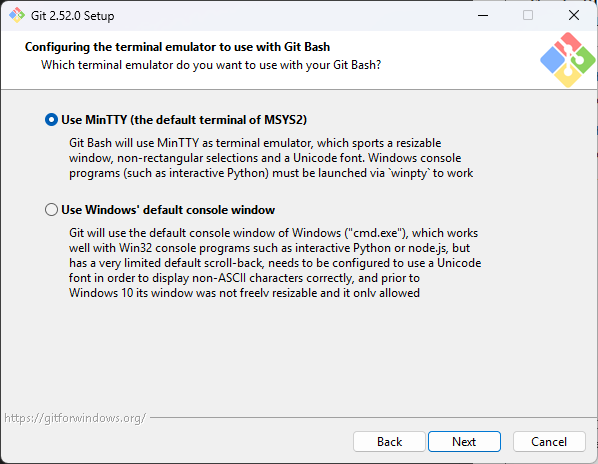

13. En las opciones adicionales, deje las opciones por defecto (cache de credenciales, símbolos, etc.) y presione **Next**.

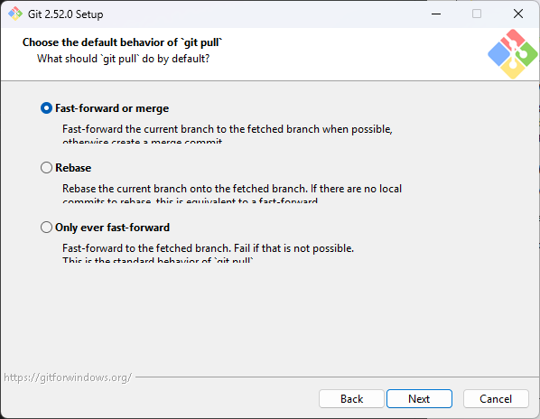

14. Si el instalador ofrece opciones experimentales, déjelas desactivadas y presione **Install**.

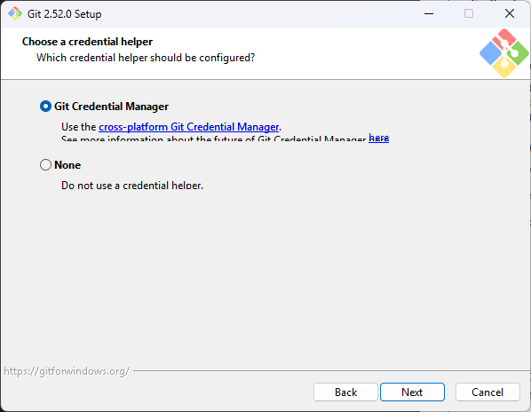

15. Espere a que el instalador complete la copia de archivos.

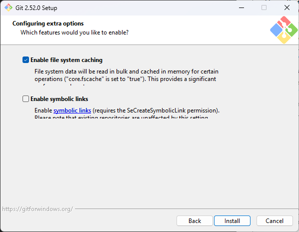

16. Finalice la instalación. Puede dejar marcada la opción de ver las notas de la versión y presionar **Finish**.

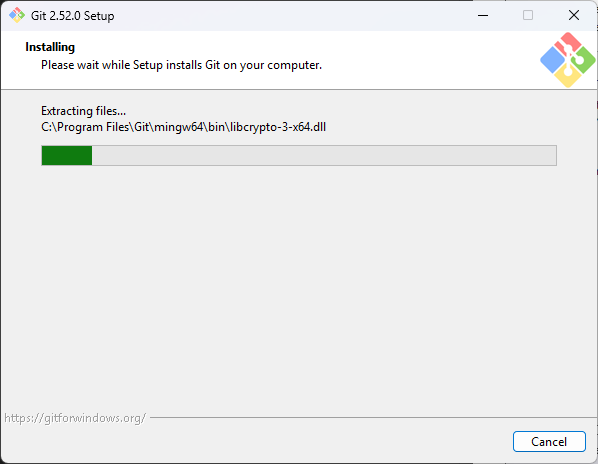

17. Para verificar la instalación, abra una terminal (PowerShell, CMD o Git Bash) y ejecute:

    ```bash
    git --version
    ```

    Debe mostrar la versión instalada, por ejemplo `git version 2.4x.x.windows.1`.

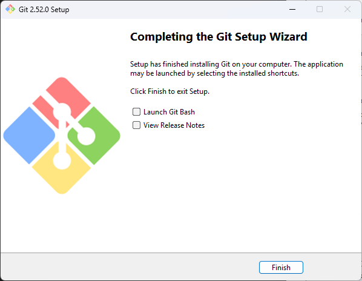

## Uso en Visual Studio Code

- Abra VSCode y presione `Ctrl + Shift + G` para ver el panel de **Control de código fuente**.
- Inicialice un repositorio con el botón **Inicializar repositorio** o clonando desde la URL (`Ctrl + Shift + P` → *Git: Clone*).
- Para autenticarse con GitHub desde WSL2 o Windows, consulte la [guía de autenticación de GitHub](../programming/git_ros_wsl2.qmd).

## Verificación

- [ ] `git --version` responde correctamente en la terminal.
- [ ] VSCode muestra el panel de Control de código fuente (`Ctrl + Shift + G`).
