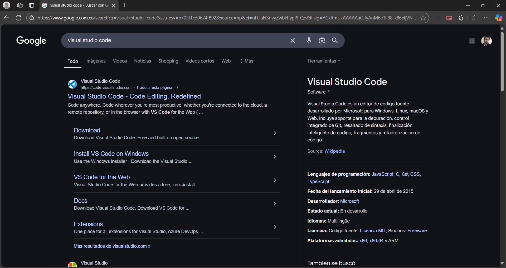
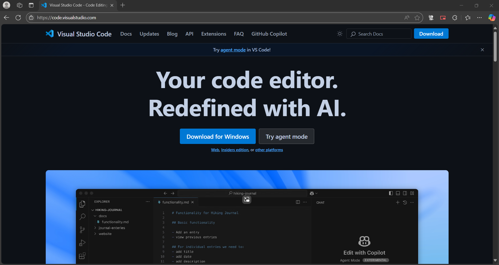
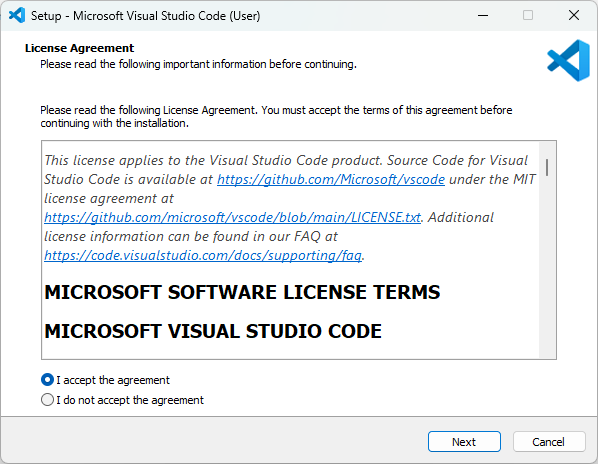
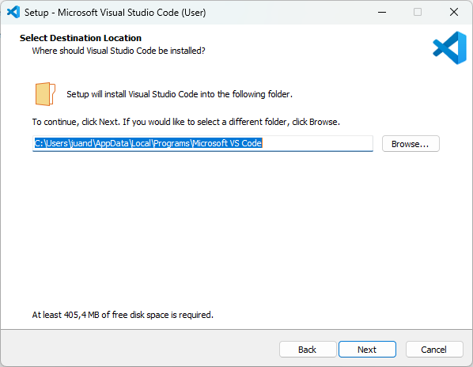
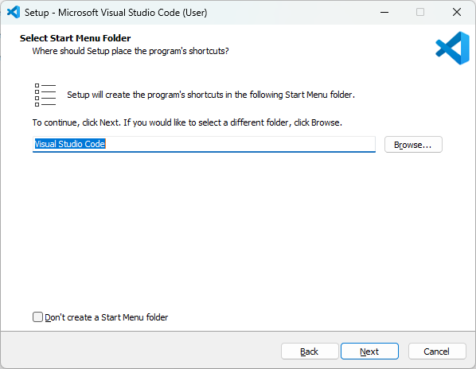
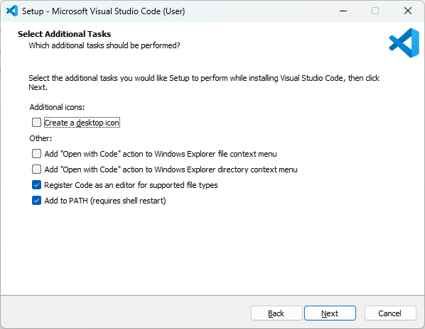
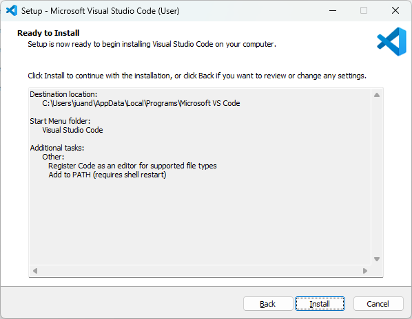
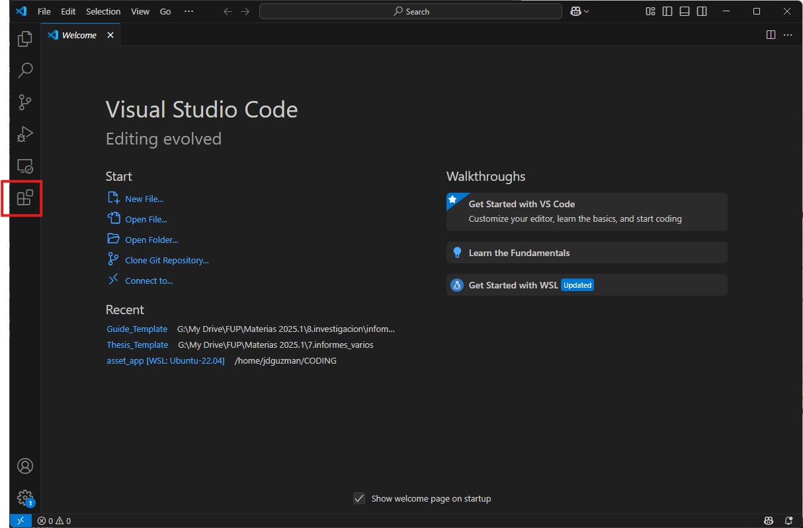

Visual Studio Code es el editor utilizado en los cursos de programación, instrumentación y documentación por código. Esta guía cubre su instalación en sistemas operativos Windows y macOS.

## Requerimientos

- Sistema operativo Windows 11 o macOS.
- Conexión a internet para la descarga del instalador.

## Descarga del instalador

Busque en el navegador web de preferencia el software "Visual Studio Code". Acceda al primer enlace, y busque la opción de "Descargar".

Descargue la versión de Visual Studio Code según corresponda con su sistema operativo. En el caso de Windows, se descargará un archivo de instalación ejecutable.

## Proceso de instalación

Ejecute el archivo descargado. Acepte el acuerdo de licencia y presione "Siguiente".

Indique la ruta de instalación del programa. Se sugiere dejar la ruta por defecto.

En la siguiente ventana indique el nombre del acceso rápido. Se sugiere dejar la opción por defecto. Presione "Siguiente" para continuar.

Seleccione las preferencias según sea de su interés. Se sugiere dejar la configuración por defecto. Presione "Siguiente".

Inicie el proceso de instalación con la opción "Instalar".

Una vez finalice la instalación, puede proceder a cerrar la ventana de instalación.

## Verificación

Abra la aplicación. En la ventana de la aplicación, presione sobre la opción resaltada en la imagen para dirigirse al gestor de extensiones.

Ha instalado satisfactoriamente Visual Studio Code. Ahora puede instalar las extensiones necesarias para cada curso, siguiendo las guías de [configuración de Markdown](vscode_md_setup.qmd), [LaTeX](vscode_latex_setup.qmd), [Python](../programming/vscode_python_install.qmd) o [Quarto](vscode_quarto_install.qmd).
