El siguiente documento tiene por objetivo documentar el proceso de instalación de los software Strawberry Perl y MiKTeX, para la elaboración de documentos en el editor de texto LaTeX en un ordenador.

## Requerimientos
- Sistema operativo Windows 11 o macOS.
- Tener instalado Visual Studio Code. Si aún no lo tiene, siga la [guía de instalación de Visual Studio Code](vscode_install.qmd).

## Instalación de Strawberry Perl.

Buscar en el navegador web de preferencia el software "Strawberry Perl". Acceder al primer enlace.

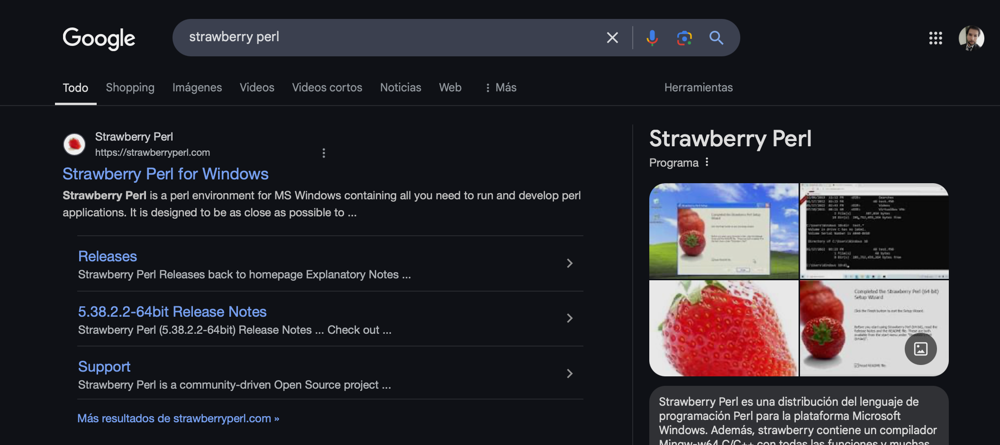

Descargar el paquete MSI para el proceso de instalación en sistemas operativos Windows. En caso de los sistemas operativos macOS, puede instalar el software mediante el gestor de paquetes "homebrew".

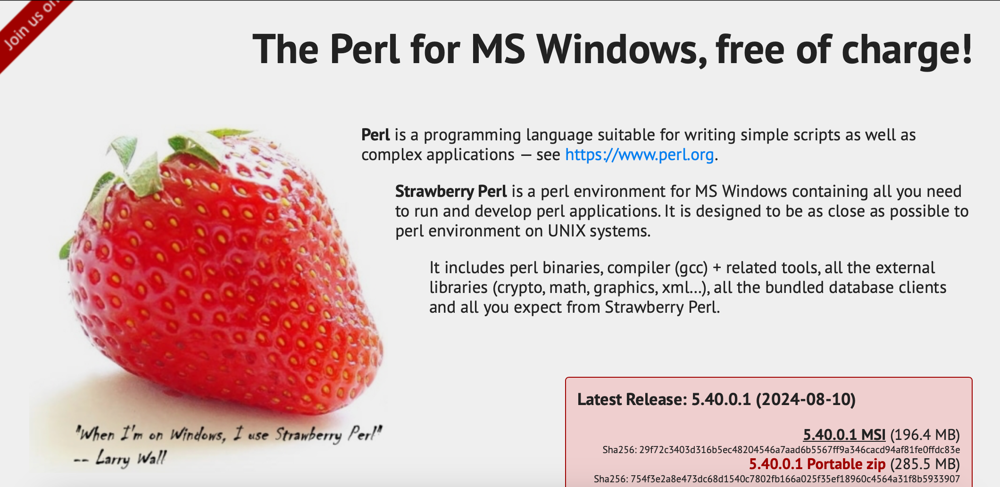

Ejecute el archivo descargado. En la interfaz emergente, presione "Si", luego "Siguiente".

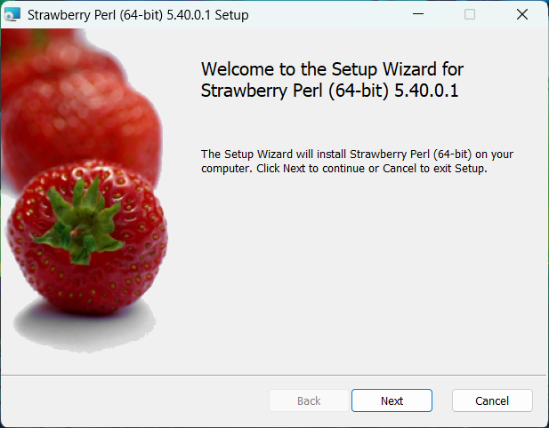

Habilite la casilla del acuerdo de licencia, y presione "Siguiente".

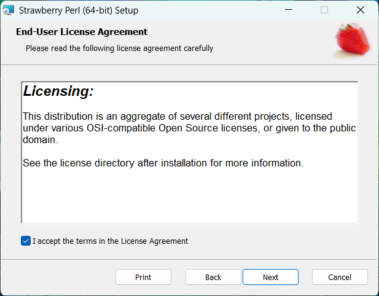

En la siguiente ventana, indique la ruta de instalación del programa. Se sugiere dejar la ruta por defecto.

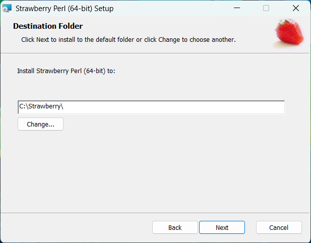

Presione "Instalar".

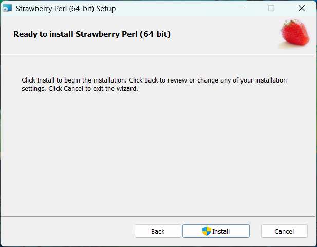

Finalmente, puede presionar sobre la opción "Finalizar". Ha instalado satisfactoriamente, Strawberry Perl. El software no requiere configuración adicional.

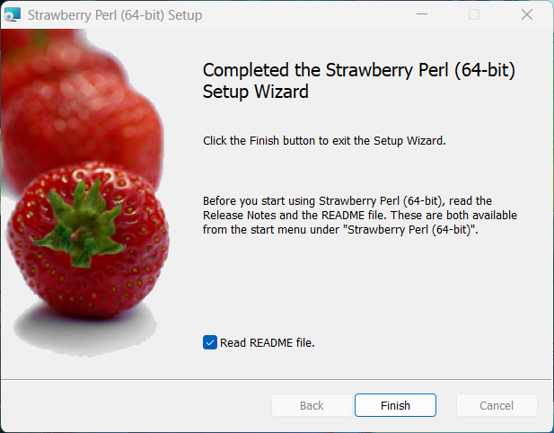

## Instalación de MiKTeX.

Buscar en el navegador web de preferencia el software ''Miktex''. Acceder al primer enlace y dirigirse a la pestaña de ''Descargas''.

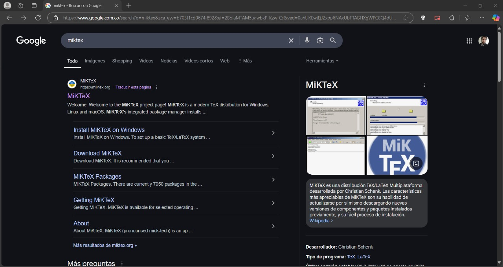

Escoger el archivo de instalación según corresponda al sistema operativo que usted maneje. Una vez descargado, ejecutelo e inicie el proceso de instalación.

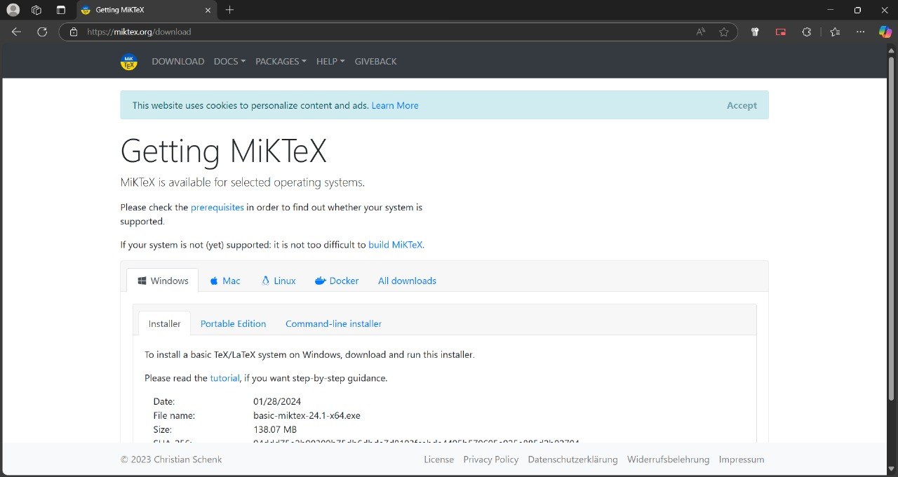

Acepte el acuerdo de licencia. Presione ''Siguiente''.

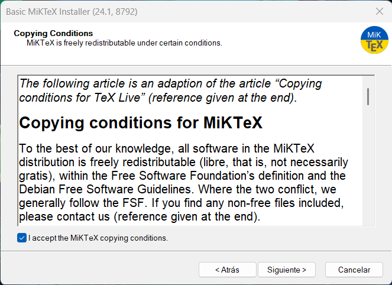

Indique si la instalación se realizará para un único usuario o para cualquier usuario del ordenador. Se recomienda dejar el valor por defecto.

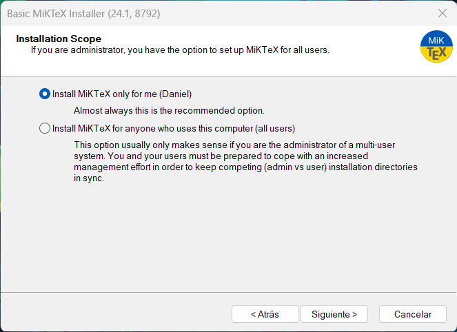

Indique la ruta de instalación. Se Sugiere dejar la ruta de instalación por defecto. Presione ''Siguiente''.

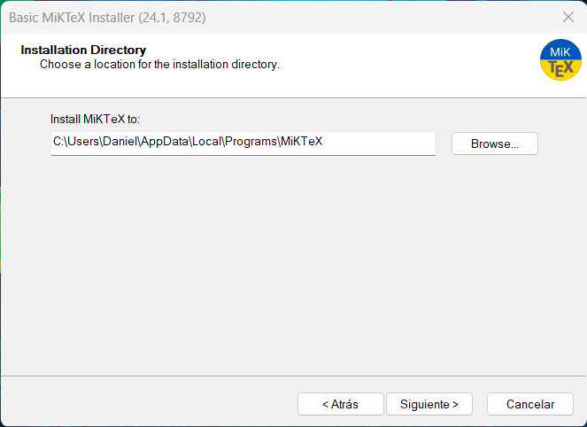

En la siguiente ventana indique las preferencias de configuración. Se sugiere dejar las opciones por defecto. Presione ''Siguiente''.

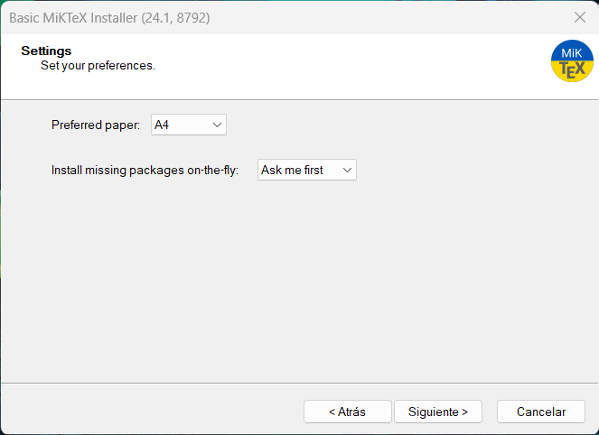

Presione sobre el boton de ''Iniciar'' para empezar el proceso de instalación.

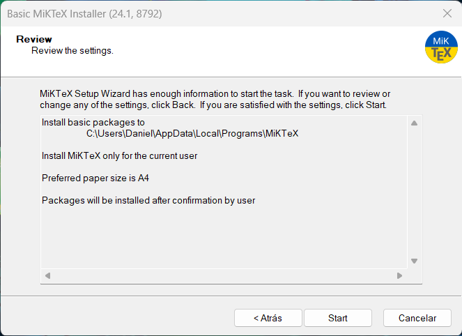

Una vez finalice la barra de progreso, presione sobre ''Siguiente''.

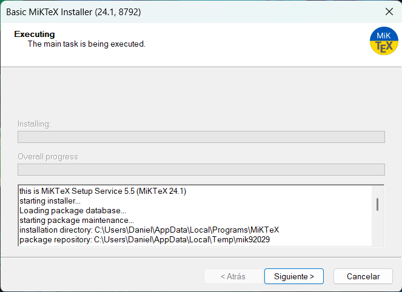

En la siguiente ventana, deje marcada la opción y presione ''Siguiente''.

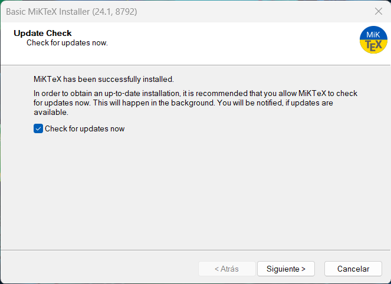

Puede cerrar la ventana presionando sobre la opcion ''Cerrar''.

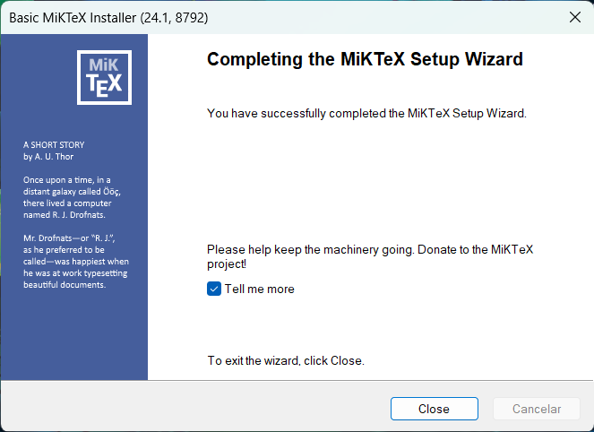

Dirijase al navegador de Windows, y ejecute la aplicación Miktex. En la ventana de la aplicación presione sobre la opción ''Switch to MIKTeX administrator mode'', esto le otorgará permisos de administrador para realizar la instalación de los paquetes de LATEX.

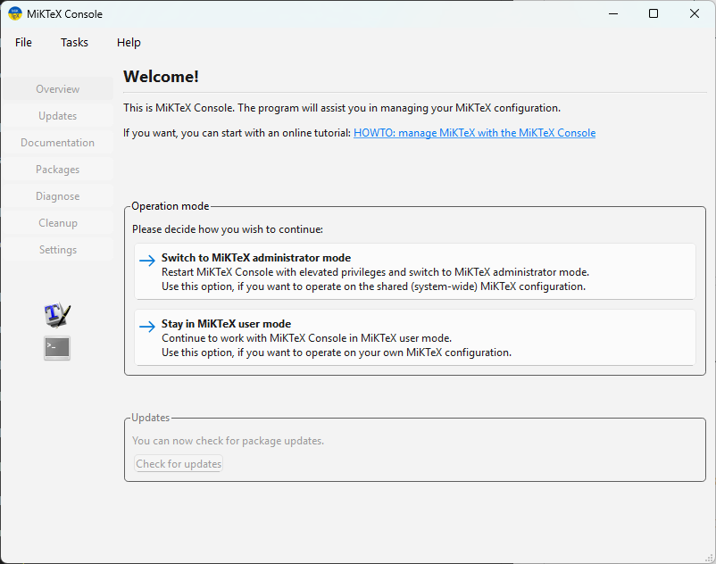

Al reiniciar la aplicación, dirijase al menú de ''Updates'', busque por nuevas actualizaciónes presionando sobre la opción ''Check for updates''.

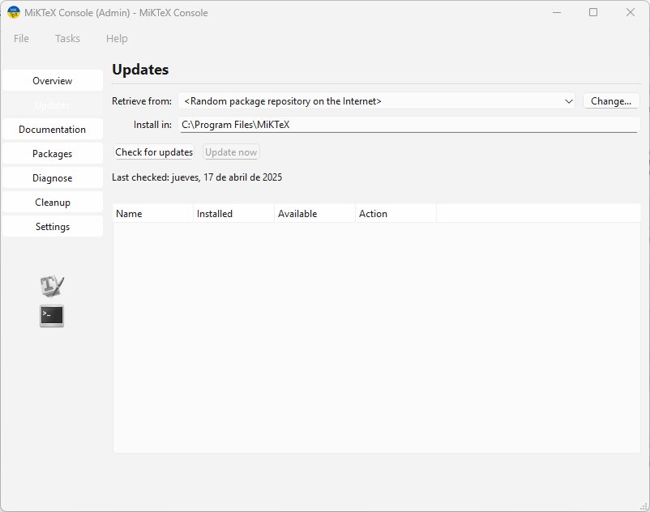

Una vez cargados los paquetes desactualizados, puede proceder a actualizarlos/instalarlos presionando sobre el botón ''Update Now''.

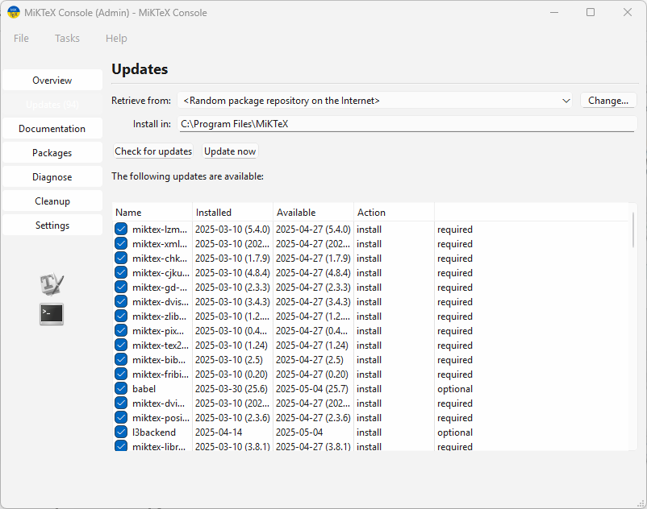

Ha finalizado satisfactoriamente el proceso de instalación y configuración de MiKTeX. No se requiere configuración adicional.

## Instalación de Visual Studio Code.

Visual Studio Code es el editor de código sobre el cual se trabajará con LaTeX. Su proceso de instalación se documenta en la [guía de instalación de Visual Studio Code](vscode_install.qmd).

Una vez instalado, abra la aplicación. En la ventana de la aplicación, presione sobre la opción resaltada en la imagen para dirigirse al gestor de extensiones.

En la barra de búsqueda, ingrese "latex workshop" para filtrar el paquete de LaTeX. Presione sobre la extensión "Latex Workshop" del autor James Yu y presione sobre el botón instalar.

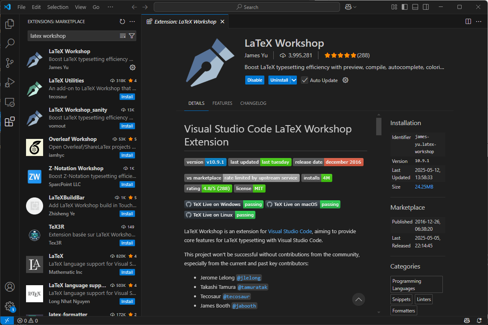

Ha instalado satisfactoriamente VSCode con LaTeX. ¡Felicidades! Puede empezar su proyecto de LaTeX.

**NOTA: Cuando realice su primera compilación, será necesario instalar los paquetes adicionales que sugiere el entorno de VSCode.**

## Recomendaciones para VSCode-Latex.
Para ajustar la ventana de edición de codigo y la presentación de su PDF, puede presionar sobre la opción de la parte superior derecha ''Dividir Editor'' (Split Editor). Puede presionar sobre el archivo PDF de su proyecto para que este se despliegue en esta nueva ventana. Recuerde que el archivo se abre en la ventana activa, por lo que se sugiere editar en la parte central, y visualizar el PDF en la parte derecha, tal y como lo muetra la siguiente imagen.
    
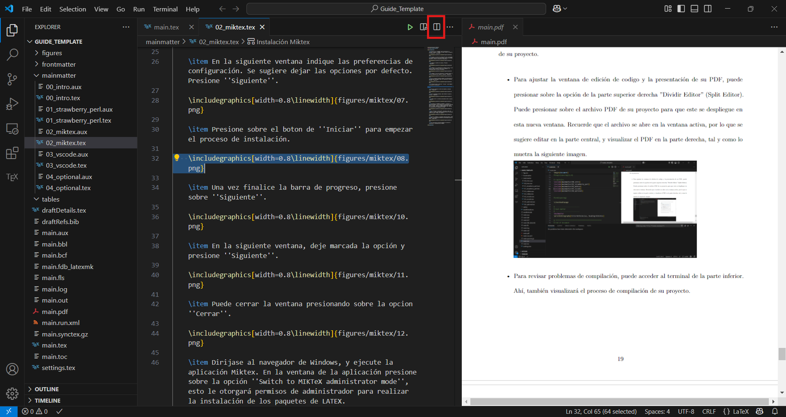

Para revisar el proceso de compilación, puede acceder al terminal desde la parte inferior de la ventana. Podrá visualizar mensajes de información, advertencia y errores de compilación. Recuerde que las advertencias, no son errores, por lo que su proyecto compilará.
    
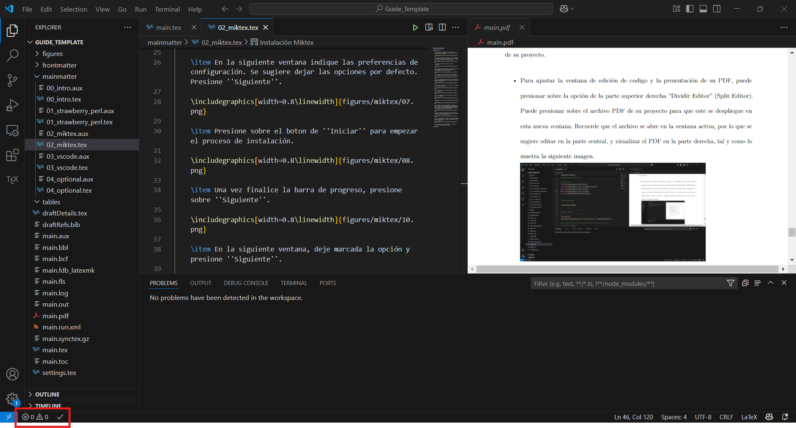

Para ajustar el despliegue de código en la interfaz, acceda al menu ''Preferencias/Editor'' y busque la opción ''Wrap lines''.
    
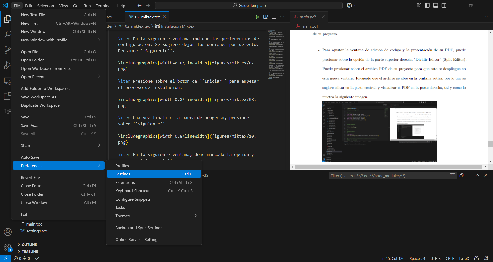

Habilite la opción configurandola como ''no''.
    
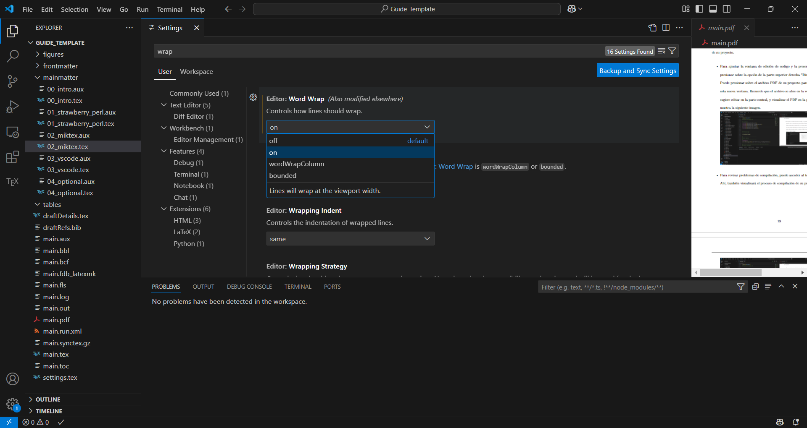

## Recomendaciones para codigo Latex.
Para la edición de tablas, se sugiere usar la pagina web ''Latex Table Generator'', y guardar los archivos para editar en caso de que se requiera. 
    
Se sugiere crear un archivo de texto (con extensión *.tex) por cada capítulo que requiera su documento. Recuerde que debe incluir el archivo en el archivo main.tex con el comando ''include''.
    
Para ajustar configuraciones de paquetes, o añadir nuevos paquetes a su proyecto, utilice el archivo settings.tex.